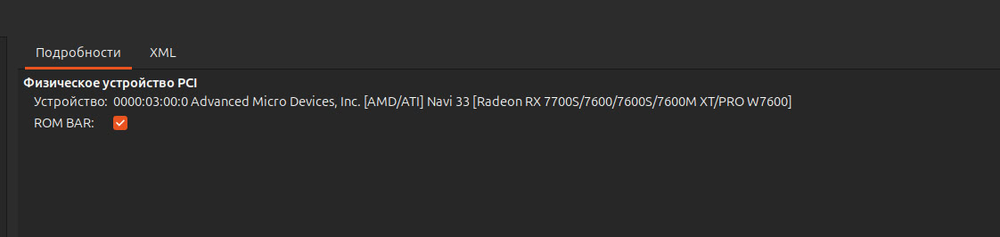
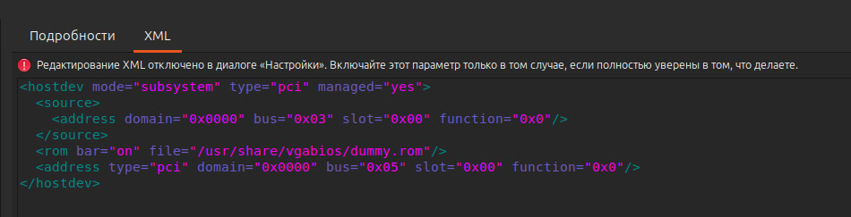
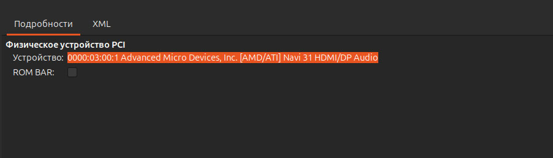

# Примечание
VT-d в BIOS не забудь включить.

# iommu.sh
```sh
root@anaconda:~# bash iommu.sh
Group 0:	[8086:4c53]     00:00.0  Host bridge                              Device 4c53
Group 1:	[8086:4c01] [R] 00:01.0  PCI bridge                               Device 4c01
Group 2:	[8086:4c09] [R] 00:06.0  PCI bridge                               Device 4c09
Group 3:	[8086:43ed]     00:14.0  USB controller                           Tiger Lake-H USB 3.2 Gen 2x1 xHCI Host Controller
USB:		[1d6b:0002]		 Bus 001 Device 001                       Linux Foundation 2.0 root hub
USB:		[05e3:0608]		 Bus 001 Device 003                       Genesys Logic, Inc. Hub
USB:		[048d:5702]		 Bus 001 Device 005                       Integrated Technology Express, Inc. RGB LED Controller
USB:		[1d6b:0003]		 Bus 002 Device 001                       Linux Foundation 3.0 root hub
		[8086:43ef]     00:14.2  RAM memory                               Tiger Lake-H Shared SRAM
Group 4:	[8086:43e0]     00:16.0  Communication controller                 Tiger Lake-H Management Engine Interface
Group 5:	[8086:43d2]     00:17.0  SATA controller                          Device 43d2
Group 6:	[8086:43c4] [R] 00:1b.0  PCI bridge                               Device 43c4
Group 7:	[8086:43bc] [R] 00:1c.0  PCI bridge                               Tiger Lake-H PCI Express Root Port #5
Group 8:	[8086:43b0] [R] 00:1d.0  PCI bridge                               Tiger Lake-H PCI Express Root Port #9
Group 9:	[8086:4387]     00:1f.0  ISA bridge                               B560 LPC/eSPI Controller
		[8086:43c8]     00:1f.3  Audio device                             Tiger Lake-H HD Audio Controller
		[8086:43a3]     00:1f.4  SMBus                                    Tiger Lake-H SMBus Controller
		[8086:43a4]     00:1f.5  Serial bus controller                    Tiger Lake-H SPI Controller
Group 10:	[1002:1478] [R] 01:00.0  PCI bridge                               Navi 10 XL Upstream Port of PCI Express Switch
Group 11:	[1002:1479] [R] 02:00.0  PCI bridge                               Navi 10 XL Downstream Port of PCI Express Switch
Group 12:	[1002:7480] [R] 03:00.0  VGA compatible controller                Navi 33 [Radeon RX 7700S/7600/7600S/7600M XT/PRO W7600]
Group 13:	[1002:ab30]     03:00.1  Audio device                             Navi 31 HDMI/DP Audio
Group 14:	[2646:5025] [R] 04:00.0  Non-Volatile memory controller           Device 5025
Group 15:	[10ec:8168] [R] 06:00.0  Ethernet controller                      RTL8111/8168/8211/8411 PCI Express Gigabit Ethernet Controller
```

# Настройки
## Создание пустого rom bar
Требуется создать rom bar по пути `/usr/share/vgabios/dummy.rom`.

Команда для создания:
```sh
dd if=/dev/zero of=dummy.rom bs=1M count=1
```

Права:
```sh
root@anaconda:~# ls -lah /usr/share | grep vga
drwxr-xr-x    2 root root 4,0K июл  7 11:52 vgabios

root@anaconda:~# ls -lah /usr/share/vgabios/
итого 1,1M
drwxr-xr-x   2 root         root 4,0K июл  7 11:52 .
drwxr-xr-x 263 root         root  12K июл  7 11:52 ..
-rw-rw-rw-   1 libvirt-qemu kvm  1,0M июл  7 07:50 dummy.rom
```

## Указание rom bar
См. [configure VM](https://github.com/ledisthebest/LEDs-single-gpu-passthrough/blob/main/VFIO/Setting%20up%20Passthrough.md).

Пример настроенных устройств:
* 
* 
* 

## Указание настроек kvm
См. [Bypass Nvidia VM detection(not required anymore as of April 2021?) Edit XML:](https://github.com/ledisthebest/LEDs-single-gpu-passthrough/blob/main/VFIO/Setting%20up%20Passthrough.md).

# Ссылки
* [List IOMMU Groups and the connected USB Devices ](https://gist.github.com/r15ch13/ba2d738985fce8990a4e9f32d07c6ada)
* [Мой идеальный компьютер](https://habr.com/ru/articles/921160/)
* [The state of AMD RX 7000 Series VFIO Passthrough (April 2024)](https://forum.level1techs.com/t/the-state-of-amd-rx-7000-series-vfio-passthrough-april-2024/210242)
* [Серия «Как использовать VFIO GPU», часть 4 — Наша первая виртуальная машина](https://vfio.blogspot.com/2015/05/vfio-gpu-how-to-series-part-4-our-first.html)
* [Proxmox 8. Настраиваем проброс видеокарты (GPU Passthrough). Выбор материнской платы на AM5 сокете](https://habr.com/ru/articles/794568/)
